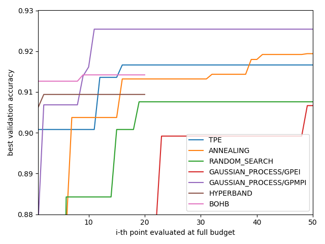
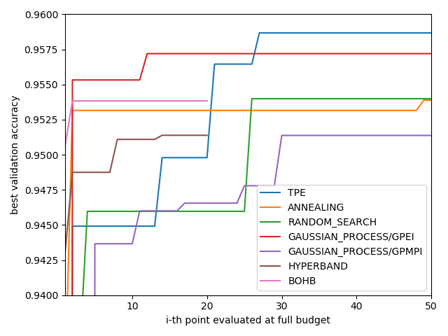
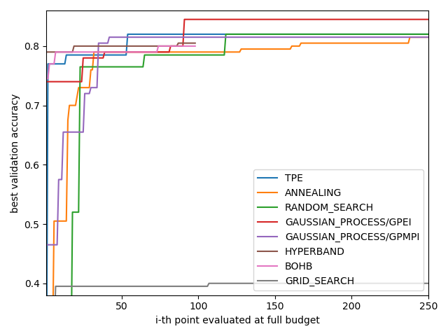
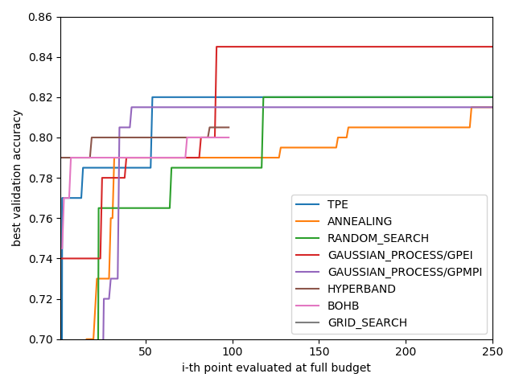
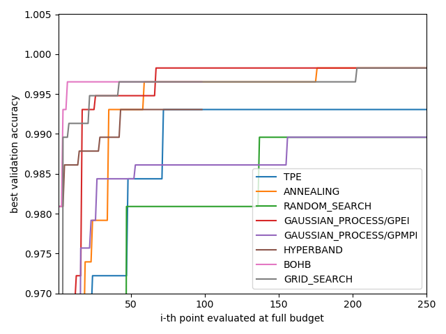
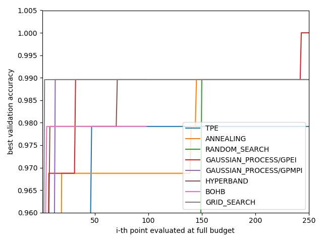
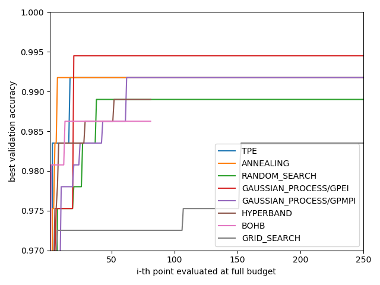

# AutoML-MAT523
Experiment and analysis over multiple hyperparameter optimization methods on differents classification task.

## Requirements

The present package is written in **Python 3.7**. In order to run a full capacity, the user should have a **Nvidia GPU** with **CUDA 10.1** installed. Also, the following HPO package are required to execute our test.

-GPyOpt \
-HyperOpt \
-HpBandSter \
-ConfigSpace

## Installation

## Results from this implementation

### CIFAR10

<b> Model: ResNet </b> 

| Hyperparameter | Distribution | Min | Max | Step | Category|
| --- | --- | --- | --- | --- | --- |
|Learning rate | Log-Uniform | 1e-7| 1e-1| N/A| N/A|
|L2 regularization | Log-Uniform | 1e-10| 1e-1| N/A| N/A |   
|ADAM eps | Discrete | 1e-8| 1e0| x10| N/A|  
|Batch size | Discrete | 50| 250| 10| N/A|  
|# Layer | Discrete | 7| 31| 3| N/A|  
|Lr decay rate | Discrete | 2| 40| 1| N/A|   
|Activation | Categorical | N/A| N/A| N/A| ELU, ReLU, Swish[1], Mish[2]|
|Version | Categorical | N/A| N/A| N/A| Post-Act, Pre-Act|

  
### SVHN

<b> Model: ResNet </b> 

| Hyperparameter | Distribution | Min | Max | Step | Category|
| --- | --- | --- | --- | --- | --- |
|Learning rate | Log-Uniform | 1e-7| 1e-1| N/A| N/A|
|L2 regularization | Log-Uniform | 1e-10| 1e-1| N/A| N/A |   
|ADAM eps | Discrete | 1e-8| 1e0| x10| N/A|  
|Batch size | Discrete | 50| 250| 10| N/A|  
|# Layer | Discrete | 7| 19| 3| N/A|  
|Lr decay rate | Discrete | 2| 40| 1| N/A|   
|Activation | Categorical | N/A| N/A| N/A| ELU, ReLU, Swish[1], Mish[2]|
|Version | Categorical | N/A| N/A| N/A| Post-Act, Pre-Act|

  
### NSPIRAL

<b> Model: Multi Layer Perceptron </b> 

| Hyperparameter | Distribution | Min | Max | Step | Category|
| --- | --- | --- | --- | --- | --- |
|Learning rate | Log-Uniform | 1e-8| 1e0| N/A| N/A|
|L2 regularization | Log-Uniform | 1e-8| 1e0| N/A| N/A |     
|Batch size | Discrete | 50| 500| 10| N/A|  
|# Layer | Discrete | 1| 20| 1| N/A|  
|Layer size | Discrete | 5| 50| 1| N/A|   

  
### DIGITS

<b> Model: SVM </b> 

| Hyperparameter | Distribution | Min | Max | Step | Category|
| --- | --- | --- | --- | --- | --- |
|C | Log-Uniform | 1e-8| 1e0| N/A| N/A|
|Gamma | Log-Uniform | 1e-8| 1e0| N/A| N/A |     

  
### IRIS

<b> Model: Multi Layer Perceptron </b> 

| Hyperparameter | Distribution | Min | Max | Step | Category|
| --- | --- | --- | --- | --- | --- |
|Learning rate | Log-Uniform | 1e-8| 1e0| N/A| N/A|
|L2 regularization | Log-Uniform | 1e-8| 1e0| N/A| N/A |     
|Batch size | Discrete | 50| 500| 10| N/A|  
|# Layer | Discrete | 1| 50| 1| N/A|  
|Layer size | Discrete | 5| 50| 1| N/A|   

  
### Breast Cancer Wisconsin

<b> Model: Multi Layer Perceptron </b> 

| Hyperparameter | Distribution | Min | Max | Step | Category|
| --- | --- | --- | --- | --- | --- |
|Learning rate | Log-Uniform | 1e-8| 1e0| N/A| N/A|
|L2 regularization | Log-Uniform | 1e-8| 1e0| N/A| N/A |     
|Batch size | Discrete | 50| 500| 10| N/A|  
|# Layer | Discrete | 1| 50| 1| N/A|  
|Layer size | Discrete | 20| 100| 1| N/A| 

## References

- [1] Ramachandran, Prajit, Barret Zoph, and Quoc V. Le. "Swish: a self-gated activation function.", (2017), arXiv preprint [arXiv:1710.059417]
- [2] Misra,D.Mish:A    Self    Regularized Non-Monotonic Neural Activation Function,2019,[arXiv:cs.LG/1908.08681]
